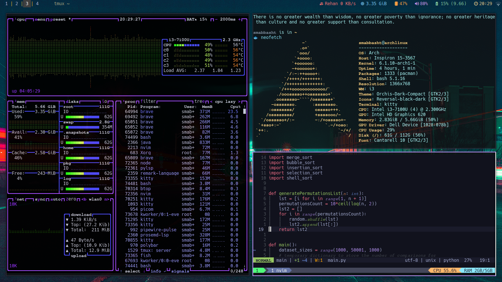
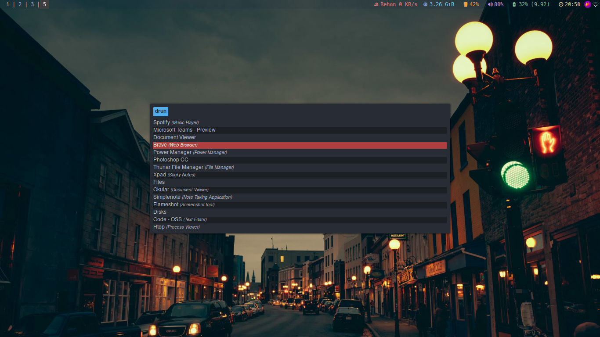

## smabbasht DotFiles

### Screenshots

|:-------------------------:|:-------------------------:|
| |  |
|  |  |

This is a repository I maintain for my personal use, in order to keep track of my dotfiles. It is super useful when I
have to setup my tools on a new machine or in case I mess around with my OS (I use Arch btw! XD) and things get serious.  
I have curated a neat UI with natural keybindings and aliases for my daily workflow tools that are listed below  
If you want to setup your .config files for the tools mentioned below, you could give these files a try for a minimal and productive setup.

I run Vanilla Arch Linux with:

*   i3 - tiling window manager
*   sddm - display manager (login manager)
*   neovim - best code and text editor out there
*   fish - shell
*   kitty - terminal emulator
*   tmux - terminal multiplexer
*   starship - shell prompt
*   rofi - applicating launcher
*   polybar - status bar client

> All config files and folders are for Linux and I haven't tested them for windows, macOS or other proprietary operating
> systems so please edit the OS specific sections if you desire to use these on them.

### Considerations

#### Tmux

*   .tmux.conf should be in your home folder, the path should be `~/.tmux.conf`, I know you can force source other
    locations but that appeared to be inconsistent to me and I have to do it repeatedly, therefore it's good to put it there, I have
    made a hard link of the two files so both the locations essentially point to the same file.

#### Neovim

*   Neovim version must be atleast 0.7 so the the version 'apt' ships on Ubuntu may not be able to run the configurations.
    On Ubuntu or other Debian based distros you could alternatively install Neovim through ppa with these commands  

<!---->

    sudo apt-get install software-properties-common
    sudo add-apt-repository ppa:neovim-ppa/stable
    sudo apt-get update
    sudo apt-get install neovim

*   For the Github copilot to run on neovim, it requires node version to be below 18 and above 16, I use it with v17.9.0 and it works
    like a charm, you can downgrade or upgrade your node version by running the commands below, nodejs and npm is required, which can
    be installed with pacman, dnf, apt etc. based on your OS and distro.

<!---->

    sudo pacman -S nodejs npm

you should replace pacman with your package manager eg. apt, dnf, rpm etc.

    npm install -g n
    n 17.9.0

*   When you will first open Neovim it might give you some error, just ignore by pressing enter to get the default look of neovim,
    once you do this, type `:PackerSync` in normal mode to get all the packages installed, once it's done, quit the neovim and
    relaunch it, it will start configuring some other stuff you can see that in lualine, once it's done (probably takes a minute or two)
    you could now use your neovim as normal.
*   For getting language support, format features and intellisense for languages you use, use Mason, you can lanch it by typing `:Mason`
    in normal mode, press Ctrl-F and see the number of your desired language by navigating through space and enter that number in the dialog
    below the list of languages (go there by pressing space multiple times), it will shortlist the packages for your language navigate to
    your desired package and press I to install, X to uninstall and U to update, press Esc to get to default Mason screen, you can now go
    setup the environment for your next language if you wish to.

#### SDDM 

*   SDDM has a few config file locations you can edit any of them to setup theme and do other customizations; typical locations are `/usr/lib/sddm/sddm.conf.d/default.conf`, `/etc/sddm.conf.d`.
*   SDDM themes live here: `/usr/share/sddm/themes/`, If you wish to use any theme you can either download it from `AUR` or use `yay` to install it if you're on arch 
or you could do it manually as described [here](https://store.kde.org/p/1312658) 
*   Themes can be modified by editing `/usr/share/sddm/themes/theme-name/theme.conf`, 
*   I use `sugar-dark` as my sddm theme. `sugar-candy` is also a good option. 
*   Common modifications to theme could be:  
    * Changing the background which could be done by editing `theme.conf`
    * Disabling *1s* peek for password letters while entering
      for this, you need to set `config.ForceHideCompletePassword == "true"` in `Components/Input.qml`
    * Forcing the first letter of username to be lowercase as usernames aren't meant be Capitalized, 
      for this, you need to comment out `font.capitalization: Font.Capitalize` in `Components/Input.qml`

### Other Configurations

Here I have listed other productivity configurations aside from the `.config` folder  

#### i3

*   In i3, enable *Natural Scrolling* and *Tap to click* by adding the lines with Option keyword in the snippet below, it would look something like this;

<!---->

    Section "InputClass"
            Identifier "touchpad"
            MatchIsTouchpad "on"
            Driver "libinput"
            Option "Tapping" "on"
            Option "TappingButtonMap" "lrm"
            Option "NaturalScrolling" "on"
            Option "ScrollMethod" "twofinger"
    EndSection

This should be the touchpand or mouse (as per the device you desire to have natural scroling with) section in `/usr/share/X11/xorg.conf.d/40-libinput.conf` file.

*   To install themes in i3, you could use a nice utility `lxappearance`, install the desired theme to system with the relevant instructions provided by the theme distributors and then launch lxappearance and select from the list of installed themes. lxappearance is lightweight and is available in arch official repository and should also be installable with apt, dnf, rpm etc.

### Installation Scripts

#### Arch Linux

For Arch Based Distributions, the attached command will install all the dependencies

    sudo pacman -S neovim tmux kitty fish sddm starship rofi polybar i3 \
            scrot feh picom noto-fonts-emoji --noconfirm

There are some key bindings in i3 configuration file such as for `brave-browser`, `thunar`, `mailspring` etc. If you don't wish to use them then comment corresponding lines
from `line 68` to `line 83` in `i3/config` file so that i3 launches with no error. same goes if you are planning not to use `kitty` or `rofi` etc. 
> Note that if you don't comment the lines where any of the software that you don't have on the system is referenced, i3 will not launch properly and show error.

If you wish to use these nice opensource software, then install them through `pacman` and `yay` using the command added below

    sudo pacman -S yay thunar 
    yay -S brave mailspring whatsapp-for-linux

### Packages Used

*   i3
*   neovim
*   sddm
*   fish
*   kitty
*   tmux
*   starship
*   rofi
*   polybar
*   scrot
*   feh
*   picom
*   Any Nerd Font, I use `Hack Nerd Font` which is pretty nice,

> You can install any *nerd font* through their official [distributor website](https://www.nerdfonts.com/) and unzip the file in `~/.local/share/fonts/`
> If you wish to use `Hack Nerd Font` then just do this:

    wget "https://github.com/ryanoasis/nerd-fonts/releases/download/v2.3.3/Hack.zip"
    mkdir -p ~/.local/share/fonts/
    mv ./Hack.zip ~/.local/share/fonts/Hack.zip
    cd ~/.local/share/fonts
    unzip Hack.zip
    rm -rvf Hack.zip

#### [Optional Packages]

*   yay
*   thunar
*   brave
*   mailspring
*   whatsapp-for-linux

> If you wish not to use software listed in optional packages,
> please edit the `config/i3` accordingly to avoid any errors (you should then comment the corresponding lines as described above).

### File Structure

.config  

├── i3  
│   └── config  
├── nvim  
│   ├── init.lua  
│   └── plugin  
│       └── packer\_compiled.lua  
├── polybar  
│   ├── config.ini  
│   └── launch.sh  
├── README.md  
├── rofi  
│   ├── config.rasi  
│   └── themes  
│       └── dt-center.rasi  
├── tmux  
├── .tmux.conf  
├── starship.toml  
├── kitty  
│   └── kitty.conf  
├── fish  
│   ├── completions  
│   ├── conf.d  
│   │   └── dracula.fish  
│   ├── config.fish  
│   ├── config.fish.bak  
│   ├── fish\_variables  
│   └── functions  
│       ├── amake.fish  
│       ├── battery.fish  
│       ├── con.fish  
│       ├── e.fish  
│       ├── gtop.fish  
│       ├── Q.fish  
│       ├── qp.fish  
│       ├── qr.fish  
│       ├── qs.fish  
│       ├── R.fish  
│       ├── S.fish  
│       └── tmls.fish  
├── clang-format  
│   └── .clang-format  
└── latex  
   └── template.tex    

> Note: some fish functions aren't included due to irrelevance

#### Cheers
